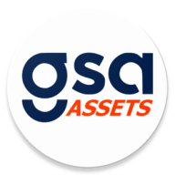
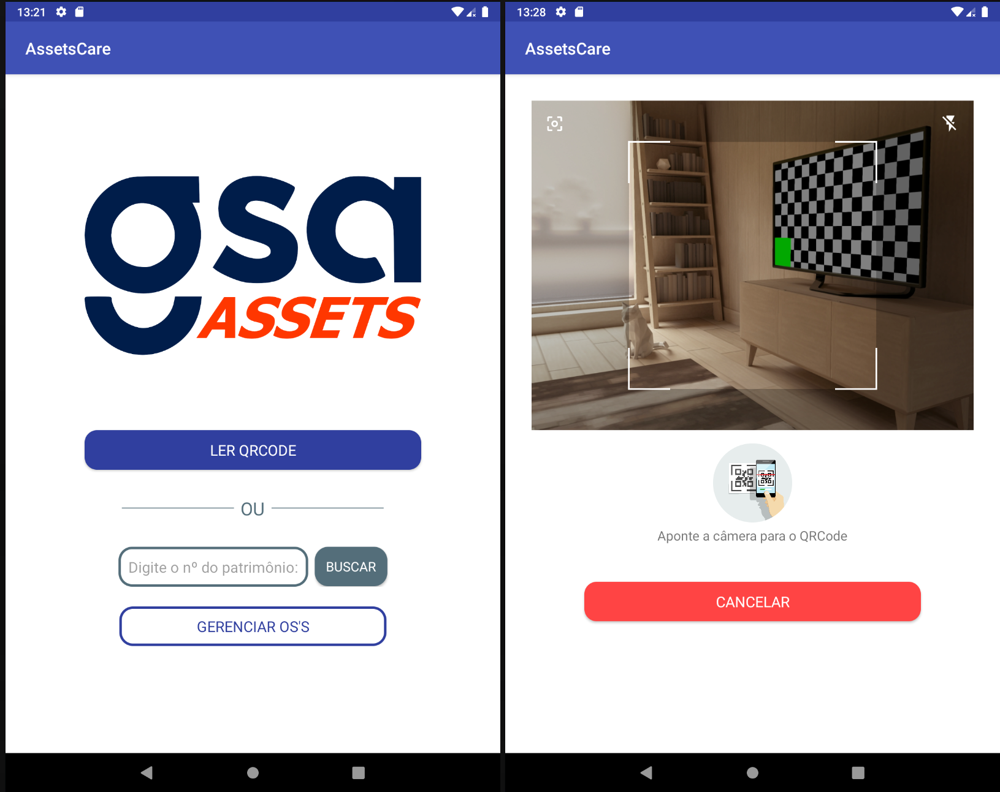

# AssetsCare
Controle de manutenção

  
  <h1>AssetsCare</h1>
  
 Assets Management and Maintenance

  

    
                 
  

#About

care your Assets!

   

 
 

<video src="https://user-images.githubusercontent.com/35613507/135867535-e6f6422f-95c6-483a-a61e-53ba6e304077.mp4" type="video/mp4">
</video>

# Technologies

  - Kotlin
  - Volley
  - JSON with GSON
  - QR Code Scanner
  - RecyclerView
  - API consume

### Requirements

- Android 5.1 or Higher

 

## License

This project is licensed under the MIT License - see the [LICENSE](LICENSE) file for details.

  Copyright © 2021-present, rafaelkenedy.

